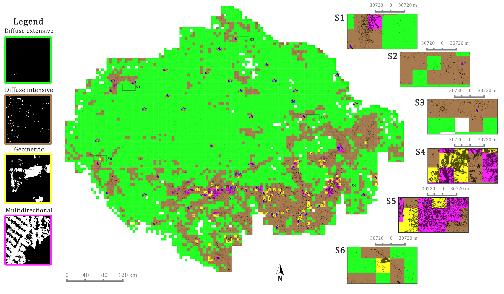

# postloss-Spattern: A data mining based tool for mapping spatial patterns of tree cover loss

Data mining based tool for mapping spatial patterns of tree cover loss according to Terra-i and Global Forest Change (GFC) datasets 

If you use this repository consider citing:
```
Coca-Castro A., Reymondin, L., Mulligan M. (2016). postloss-Spattern: A data mining based tool for mapping spatial patterns of tree cover loss. Repository created as part of a MSc. thesis entitled "Mapping deforestation stages and spatial patterns in the Amazon rainforest using fractal analysis and data mining techniques" supervised by Dr. Mark Mulligan. 
```
The tool can be executed using the demo data (inside the repository folder).

## Presentation
Theory and Hands-on slides are available inside the repository folder.

A detailed step by step guide is under preparation.

## Related links
* [Blog post](http://www.terra-i.org/news/news/How-can-the-shapes-and-distribution-of-deforested-areas-inform-us-about-the-agents-of-changes-on-the-ground-.html)

## Zenodo
[](https://doi.org/10.5281/zenodo.3551089)

## Results of best models suited to the Amazon region as defined by [RAISG](https//amazoniasocioambiental.org/en/about) 
### Using Terra-i data


### Using GFC data

